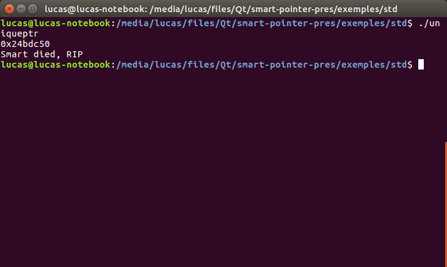
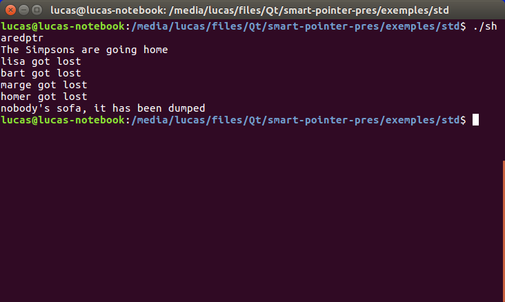

## Smart Pointers

@div[left-50]


Par Biloni Kim, Wermeille Bastien et Bulloni Lucas

@divend

@div[right-50]

@divend

---

### Sommaire

@ul
- Qu'est ce que les Smart Pointers?
- STD bibliothèque
 - shared_ptr
 - weak_ptr
 - unique_ptr
- Qt
 - Pointeurs similaires
 - QSharedDataPointer
 - QScopedPointer et QScopedArrayPointer
@ulend

---

### Qu'est-ce que les Smarts Pointers

- But : ne pas devoir à réfléchir quand `delete`
- Objet qui va stocker un pointeur
- Ce n'est pas un système Garbage Collector comme en java
- Il faut quand même réfléchir auquel utiliser

---

#### Principe

```c++
template <typename T>
class UniquePtr
{
public:
  UniquePtr(T* object)
  {
    this->object = object;
  }
  ~UniquePtr()
  {
    delete this->object;
  }
private:
  T* object;
};
```

---

### STD biblothèque

 - `#include <memory>`
 - auto_ptr avec C++98
  - Déprecié
 - Utiliser les pointeurs que l'on va vous présenter.
 - Accéder au pointeur originel avec .get()

---

#### `unique_ptr`

- Evolution de auto_ptr
- Un objet ne peut être que dans un seul unique_ptr
- Marche également avec les tableaux de données
 - appelle de delete[]
- http://en.cppreference.com/w/cpp/memory/unique_ptr

---

#### `unique_ptr` - Classe (code)

```c++
class Person
{
public:
    Person(string name)
    {
        this->name = name;
    }
    ~Person()
    {
        cout << this->name << " died, RIP" << endl;
    }
private:
    string name;
};
```
---

#### `unique_ptr` - main (code)

```c++
int main()
{
    Person* dumb = new Person("Dumb");
    unique_ptr<Person> smart(new Person("Smart"));
    unique_ptr<int[]> intPtr(new int[10000000]);

    cout << smart.get() << endl;

    return 0;
}

```

---

#### `unique_ptr` (exécution)



---

#### `shared_ptr`

 - Pointeur partagé entre plusieurs objets
 - Sera détruit quand la dernière référence sera détruite
 - /!\ Ne pas créer de smart pointers depuis un pointeurs déjà dans un shared_ptr /!\

```c++
Sofa* sofa = new Sofa();
Simpson homer("homer", sofa); // NON !
```

 - http://en.cppreference.com/w/cpp/memory/shared_ptr

---

#### `shared_ptr` - Classes (code)

 ```c++
class Sofa
{
public:
 Sofa() {}
 ~Sofa()
 {
   cout << "nobody's sofa, it has been dumped" << endl;
 }
};

class Simpson
{
public:
 Simpson(string name, shared_ptr<Sofa> sofa) : sofa(sofa)
 {
   this->name = name;
 }
 ~Simpson()
 {
   cout << this->name << " got lost" << endl;
 }
private:
 shared_ptr<Sofa> sofa;
 string name;
};

 ```

---

#### `shared_ptr` - Main (code)

```c++
int main()
{
  shared_ptr<Sofa> sofa(new Sofa());
  Simpson homer("homer", sofa);
  Simpson marge("marge", sofa);
  Simpson bart("bart", sofa);
  Simpson lisa("lisa", sofa);

  cout << "The Simpsons are going home" << endl;
}
```

---

#### `shared_ptr` (exécution)



---


---

#### weak_ptr

- Résoud les problèmes de références cycliques
- Vérification de la validité de la  référence

Note:
- Ref cyclic -> création d'un shr depuis un autre shr
- Provoque exception de la part du cstr
---

#### weak_ptr (code)

```c++
#include <iostream>
#include <memory>

std::weak_ptr<int> gw;

void f()
{
    if (auto spt = gw.lock()) { std::cout << \*spt << "\n"; }
    else { std::cout << "gw is expired\n"; }
}

int main()
{
    {
        auto sp = std::make_shared<int>(42);
	    gw = sp;
	    f();
    }
    f();
}
// Resultats :
// 42
// gw is expired
```
Note:
- gw est déclarer en global
- MAIN
  - déclaration de sp sur val 42
  - cstr de gw à partir de sp
  - appel de f()
  - essai de récupération du ptr
  - appel hors du scope
---

#### weak_ptr (fonctions)

- `std::shared_ptr<T> lock() const;`
- `bool expired() const;`
- `long use_count() const;`

Note:
- lock() utilise expired()
- expired() utilise use_count()
- use_count() compte le nb de ref
---

### Qt
Notions élémentaires:
- Shared pointer versus shared data
- Shared pointer
 - Partage d'un pointeur
 - Aucun intérêt pour les données partagées en soit
- Shared Data
 - Partage de données
 - Aucun intérêt pour le pointer en soit ou la manière dont sont partagées les données
---

### Qt
Notions élémentaires 2
- Strong versus weak

---

#### Pointeurs similaires

---

#### QSharedDataPointer
- Partage de **données**, pas d'un ~~pointeur~~
- Ce qui implique quelles peuvent être copiées

```c++
#include <QSharedData>
class SimpsonMemberData : public QSharedData
{
public:
    SimpsonMemberData() : age(-1) { }
    SimpsonMemberData(const SimpsonMemberData &other) : QSharedData(other), age(other.age), name(other.name) { }
    ~SimpsonMemberData() {}
    int age;
    QString name;
};


class SimpsonMember
{
public:
    SimpsonMember() { \_data = new SimpsonMemberData; }
    SimpsonMember(int age, const QString &name) {
        \_data = new SimpsonMemberData();
        setAge(age);
        setName(name);
    }
    SimpsonMember(const SimpsonMember &other)
          : \_data (other.\_data)
    {
    }
    void setAge(int age) { \_data->age = age; }
    void setName(const QString &name) { \_data->name = name; }

    int age() const { return \_data->age; }
    QString name() const { return \_data->name; }

  private:
    QSharedDataPointer<SimpsonMemberData> \_data;
};

int main(int argc, char *argv[])
{
    SimpsonMember homer(10, "Homer Simpson");
    SimpsonMember barth = homer;
    barth.setName("Barth Simspon");
    homer.setAge(50);

    qDebug() << "Nom : " << homer.name() << "\t age : " << homer.age();
    // -> "Nom : Homer Simpson    age : 50";
    qDebug() << "Nom : " << barth.name() << "\t age : " << barth.age();
    // -> "Nom : Barth Simpson    age : 10";
}
```

---
#### `QExplicitlySharedDataPointer`
- Identique à `QSharedDataPointer` à une énorme différences près:
 - Pas de *copie* des données lors de la copie du pointer
 - _Possibilité de préciser si l'on veut que les données soient dupliquées avec **detach()**_

```c++
int main(int argc, char *argv[])
{
   SimpsonMember homer(10, "Homer Simpson");
   SimpsonMember barth = homer;
   barth.setName("Barth Simspon");
   homer.setAge(50);

   qDebug() << "Nom : " << homer.name() << "\t age : " << homer.age();
   // -> "Nom : Barth Simpson    age : 50";
   qDebug() << "Nom : " << barth.name() << "\t age : " << barth.age();
   // -> "Nom : Barth Simpson    age : 50";
}
```
---

#### `QScopedPointer`
- Permet d'assurer qu'un objet sera supprimé à la sortie de la portée dans laquelle il est instancié

Exemple sans
```c++
void useCanape(bool homer, int chaine)
{
    Canape \*canape = homer ? new Fauteuil() : new Canape(5);
    Telecommande \*telecommande = Telecommande::createTelecommande();

    if (chaine < 1) {
        delete canape;
        delete telecommande;
        return;
    }

    try {
        useTelecommande(telecommande);
    } catch (...) {
        delete canape;
        delete telecommande;
        throw;
    }

    delete canape;
    delete telecommande;
}

void useTelecommande(Telecommande* telecommande){
    //Quelque chose qui pourrais lancer une exception !
}
```

---
#### `QScopedPointer`
Exemple avec:

```c++
void useCanape(bool homer, int chaine)
{
    // assuming that MyClass has a virtual destructor
    QScopedPointer<Canape> p(homer ? new Fauteuil() : new Canape(5));
    QScopedPointer<Telecommande> telecommande(Telecommande::createTelecommande());

    if (chaine < 1)
        return;

    useTelecommande(telecommande);
}

void useTelecommande(QScopedPointer<Telecommande>& telecommande){
    //Quelque chose qui pourrais lancer une exception !
}
```

---

#### `QScopedArrayPointer`
- Identique à `QScopedPointer` mais pour des tableaux d'objets

```c++
void foo()
{
    QScopedArrayPointer<int> i(new int[10]);
    i[2] = 42;
    ...
    return; // our integer array is now deleted using delete[]
}
```
---

### Exercice

---

### Conclusion

---

### Référence


 - https://stackoverflow.com/questions/106508/what-is-a-smart-pointer-and-when-should-i-use-one
 - http://ootips.org/yonat/4dev/smart-pointers.html
 - https://www.codeproject.com/Articles/541067/Cplusplus-Smart-Pointers
 - https://wiki.qt.io/Smart_Pointers
